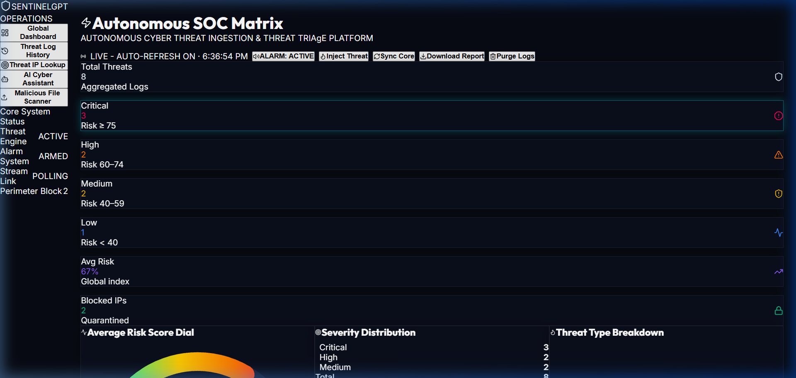
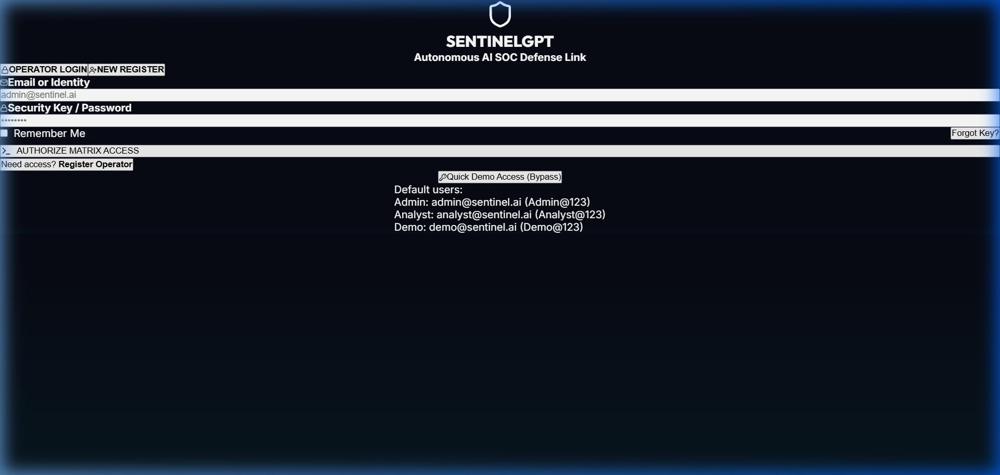
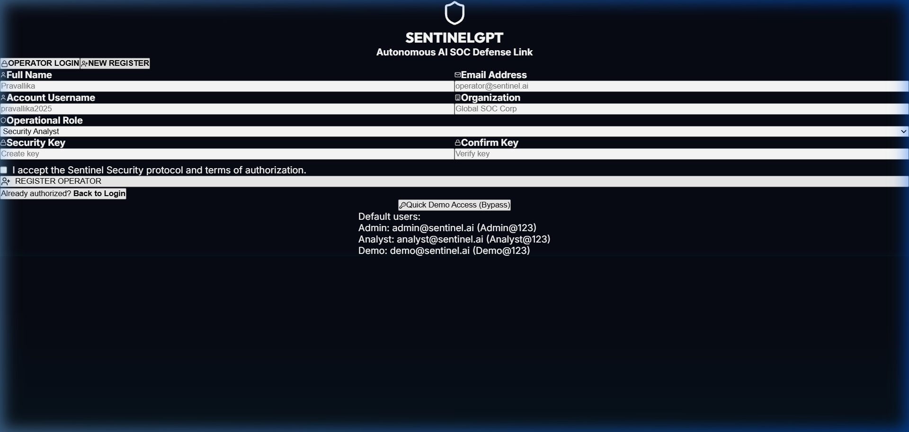
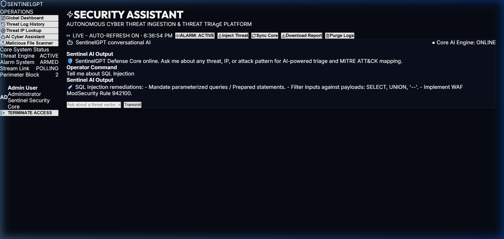
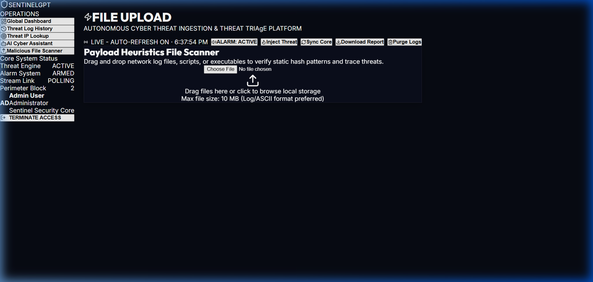

<div align="center">


# 🛡️ SentinelGPT — Autonomous Cyber Defense Platform

**Real-time AI-powered cybersecurity monitoring, threat detection, and autonomous defense dashboard**

[](https://sentinelgpt-ai.vercel.app)
[](https://react.dev)
[](https://fastapi.tiangolo.com)
[](https://python.org)
[](https://sqlite.org)
[](LICENSE)

</div>

---

## 📖 Project Description

**SentinelGPT** is a full-stack autonomous cybersecurity operations center (SOC) dashboard built for real-time threat detection, incident management, and AI-assisted remediation. It combines a **React 19** frontend with a **FastAPI Python** backend deployed serverlessly on **Vercel**.

The platform monitors network threats in real-time, maps them to **MITRE ATT&CK** techniques, provides **AI-generated remediation recommendations**, and automatically quarantines malicious IPs — all from a sleek, dark-mode glassmorphism operations dashboard.

> **Built as an MCA Final Year Project** demonstrating expertise in full-stack development, cybersecurity principles, real-time systems, and cloud deployment.

---

## ✨ Features

| # | Feature | Description |
|---|---------|-------------|
| 1 | 🔴 **Real-time Threat Detection** | Live threat feed with autonomous heuristic analysis |
| 2 | 🤖 **Autonomous Monitoring** | Background workers detect and log events 24/7 without intervention |
| 3 | 💉 **Threat Injection** | Manual test threat injection for security validation |
| 4 | 📊 **Risk Analysis** | Severity scoring (Critical/High/Medium/Low) with visual indicators |
| 5 | 📈 **Telemetry Dashboard** | 7 real-time KPI metric cards with live counters |
| 6 | 📉 **Interactive Charts** | Risk Gauge, Severity Donut, Threat Breakdown Bar, Risk Timeline |
| 7 | 🔌 **WebSocket Support** | Real-time bidirectional data streaming (local dev) |
| 8 | 🌐 **REST API** | Full CRUD API with Swagger documentation |
| 9 | 🔐 **JWT Authentication** | Secure HS256 token-based auth with 8-hour expiry |
| 10 | 💾 **SQLite Storage** | Persistent database with auto-seeding on cold start |
| 11 | 🧱 **Firewall Simulation** | Interactive IP blocking/unblocking with quarantine list |
| 12 | 🔒 **Threat Quarantine** | Automatic and manual IP isolation with revoke controls |
| 13 | 🗺️ **Sector Risk Map** | Perimeter heatmap matrix of network node threat zones |
| 14 | ⚡ **Threat Velocity** | Real-time threat flow velocity charts |
| 15 | 📜 **Incident History** | Full searchable threat log with advanced filters |
| 16 | 📥 **Export Logs** | Download complete incident reports as JSON |
| 17 | 📱 **Responsive UI** | Mobile-first glassmorphism design with smooth transitions |
| 18 | 🌙 **Dark Theme** | Cyberpunk-inspired dark mode with neon accents |

---

## 🏗️ Architecture

```
┌─────────────────────────────────────────────────────────────┐
│                    VERCEL EDGE NETWORK                       │
│                                                             │
│  ┌──────────────────────────┐  ┌──────────────────────────┐ │
│  │    React SPA Frontend    │  │   FastAPI Python Backend  │ │
│  │   (Static Build /dist)   │  │   (Serverless Function)   │ │
│  │                          │  │                           │ │
│  │  • Dashboard (SOC)       │  │  • POST /api/login        │ │
│  │  • Login / Register      │  │  • GET  /api/snapshot     │ │
│  │  • Threat History        │  │  • POST /api/block_ip     │ │
│  │  • IP Threat Analyzer    │  │  • POST /api/unblock_ip   │ │
│  │  • AI Security Assistant │  │  • POST /api/sim_threat   │ │
│  │  • File Scanner          │  │  • POST /api/clear_logs   │ │
│  │  • Attack Timeline       │  │  • GET  /api/export       │ │
│  └────────────┬─────────────┘  └────────────┬──────────────┘ │
│               │                              │                │
│               └──────────┬───────────────────┘                │
│                          │                                    │
│                  ┌───────▼────────┐                           │
│                  │   SQLite DB    │                           │
│                  │  (/tmp/senti-  │                           │
│                  │   nel.db)      │                           │
│                  └────────────────┘                           │
└─────────────────────────────────────────────────────────────┘
```

---

## 🛠️ Technology Stack

### Frontend
| Technology | Version | Purpose |
|---|---|---|
| React | 19.0 | UI Framework |
| Vite | 5.4 | Build Tool & Dev Server |
| Recharts | 2.13 | Data Visualization (Charts) |
| Lucide React | 0.454 | Icon System |
| Web Audio API | Native | Alert Alarm Sound |

### Backend
| Technology | Version | Purpose |
|---|---|---|
| FastAPI | 0.100+ | REST API Framework |
| SQLAlchemy | 2.0+ | ORM / Database Layer |
| SQLite | 3.x | Relational Database |
| PyJWT | 2.8+ | JWT Token Authentication |
| Pydantic | 2.0+ | Request/Response Validation |
| Uvicorn | 0.22+ | ASGI Server (Local Dev) |

### Infrastructure
| Technology | Purpose |
|---|---|
| Vercel | Serverless Production Deployment |
| GitHub Actions | CI/CD Pipeline |
| Vercel Python Runtime | FastAPI Serverless Functions |
| Vercel Static Build | React SPA Hosting |

---

## 🔄 Project Workflow

```
                    ┌──────────────┐
                    │     User     │
                    │  (Browser)   │
                    └──────┬───────┘
                           │
                    ┌──────▼───────┐
                    │   Frontend   │
                    │  React SPA   │
                    │  (Vite 5.4)  │
                    └──────┬───────┘
                           │
                    ┌──────▼───────┐
                    │   FastAPI    │
                    │  REST API +  │
                    │  WebSocket   │
                    └──────┬───────┘
                           │
                    ┌──────▼───────┐
                    │   Threat     │
                    │   Engine     │
                    │  (Heuristic  │
                    │  Analysis)   │
                    └──────┬───────┘
                           │
                    ┌──────▼───────┐
                    │   SQLite     │
                    │  Database    │
                    │  (Incidents, │
                    │  Quarantine) │
                    └──────┬───────┘
                           │
                    ┌──────▼───────┐
                    │  Response    │
                    │   Engine     │
                    │ (Auto-Block, │
                    │  Alerts)     │
                    └──────┬───────┘
                           │
                    ┌──────▼───────┐
                    │  Dashboard   │
                    │  (Real-time  │
                    │   Updates)   │
                    └──────────────┘
```

---

## 📊 Dashboard Preview



---

## 🚀 Project Access & Live Links

### 🌐 Live Production Access (Clickable Live Links)

| Component | Working Live URL | Description | Status |
|---|---|---|---|
| 🌐 **Live SOC Platform** | [Click to Open Platform](https://sentinelgpt-ai.vercel.app) | React SOC Operations Dashboard | 🟢 Active |
| 📡 **Live API Endpoint (Health)** | [Click to Open Health Status](https://sentinelgpt-ai.vercel.app/api/health) | FastAPI Core Health Check (returns JSON) | 🟢 Active |
| 📖 **Live API Docs (Swagger)** | [Click to Open Swagger Docs](https://sentinelgpt-ai.vercel.app/docs) | Interactive Swagger Documentation | 🟢 Active |
| 📋 **Live API Specs (OpenAPI)** | [Click to Open OpenAPI Schema](https://sentinelgpt-ai.vercel.app/openapi.json) | OpenAPI 3.0 JSON Schema | 🟢 Active |

### 🏠 Local Development Access

| Component | Local URL | Live Fallback Link | Command to Run |
|---|---|---|---|
| 🖥️ **Frontend App** | `http://localhost:5173` | [Open Live Platform](https://sentinelgpt-ai.vercel.app) | `cd frontend && npm run dev` |
| ⚙️ **Backend API (Health)** | `http://localhost:8000/api/health` | [Open Live API Health](https://sentinelgpt-ai.vercel.app/api/health) | `python backend/main.py` |
| 📖 **Backend API Docs** | `http://localhost:8000/api/docs` | [Open Live API Docs](https://sentinelgpt-ai.vercel.app/docs) | `python backend/main.py` |
| 🔌 **WebSocket Stream** | `ws://localhost:8000/ws` | — | `python backend/main.py` |
| 💾 **SQLite Database** | `./sentinel_production.db` | — | Auto-created on start |

> **Note:** The Live Vercel links are accessible 24/7 anywhere. The `localhost` URLs work when running the application locally on your machine.

---

## 🎯 Deployment Walkthrough

The platform consists of interconnected components working together:

| Component | Technology | Role |
|---|---|---|
| **Frontend** | React 19 + Vite 5.4 | Renders the SOC dashboard UI, handles user interactions, manages local state |
| **Backend** | FastAPI + SQLAlchemy | Processes API requests, manages database, handles authentication |
| **API Layer** | REST + WebSocket | Provides `/api/*` endpoints for data CRUD and `/ws` for real-time streaming |
| **Database** | SQLite | Stores incidents, quarantined IPs, user accounts |
| **Auth System** | JWT (PyJWT) | Issues and validates HS256 tokens with 8-hour expiry |
| **Threat Engine** | Python Heuristics | Analyzes traffic patterns, detects anomalies, auto-quarantines |

### Vercel Deployment Architecture
- **Static Build**: The React frontend is built via `npm run build` → served as static files from `/dist`
- **Serverless Functions**: `api/index.py` runs as a Vercel Python serverless function
- **Routing**: `vercel.json` routes `/api/*` to the Python function, all other routes to the React SPA
- **Database**: Uses `/tmp/sentinel_vercel.db` on Vercel (ephemeral, auto-seeded on cold start)

---

## 🎬 Live Working Demo

> Real-time demo of SentinelGPT in action — threat detection, live telemetry stream, security quarantine, and autonomous heuristics running live.


**Dashboard features shown:**
- 🔴 **Real-time Threat Feed** — Live streaming with auto-updating threat telemetry
- 📊 **Threat Flow Velocity Chart** and **Sector Risk Map** tabs
- 🛡️ **Security Quarantine** — IP blocking with `Revoke` controls
- ⚡ **Inject Threat** — Manual threat injection for testing
- 🔄 **Sync** — Instant data refresh
- 📈 **Live Metrics** — Incidents, Critical alerts, and Traffic counters updating in real time

---

## 📸 Additional Dashboard Screenshots

### 🔐 Cyberpunk Login Interface


### 📝 Operator Registration Portal


### 🤖 AI Security Conversational Assistant


### 📁 Heuristic Payload File Scanner


---

## 💻 Installation

### Prerequisites
- **Node.js** 18+ ([Download](https://nodejs.org))
- **Python** 3.11+ ([Download](https://python.org))
- **npm** (bundled with Node.js)
- **pip** (bundled with Python)

### 1. Clone the Repository
```bash
git clone https://github.com/Pravallika2025/sentigraud-ai-.git
cd sentigraud-ai-
```

### 2. Frontend Setup
```bash
cd frontend
npm install
npm run dev
# ✅ Opens at http://localhost:5173
```

### 3. Backend Setup
```bash
# From project root (in a separate terminal)
pip install -r requirements.txt
python backend/main.py
# ✅ API available at http://localhost:8000
```

### 4. Environment Variables (Optional)
Create `.env` in the project root:
```env
SECRET_KEY=your_jwt_secret_key_here
ADMIN_PASSWORD=your_admin_password
```

---

## 🏠 Localhost Deployment

After running both frontend and backend:

| Service | Command | Working Live URL | Local Dev URL |
|---|---|---|---|
| **Frontend** | `cd frontend && npm run dev` | [Open Live Platform](https://sentinelgpt-ai.vercel.app) | `http://localhost:5173` |
| **Backend API** | `python backend/main.py` | [Open Live API Health](https://sentinelgpt-ai.vercel.app/api/health) | `http://localhost:8000` |
| **API Docs** | `python backend/main.py` | [Open Live Swagger Docs](https://sentinelgpt-ai.vercel.app/docs) | `http://localhost:8000/api/docs` |

The Vite dev server automatically proxies `/api/*` requests to the backend, so both services communicate seamlessly.

### Login Credentials

| Method | Username | Password | Role |
|---|---|---|---|
| **Admin Login** | `admin` | `admin123` | Administrator |
| **Admin Email** | `admin@sentinel.ai` | `Admin@123` | Administrator |
| **Analyst Email** | `analyst@sentinel.ai` | `Analyst@123` | Security Analyst |
| **Demo Email** | `demo@sentinel.ai` | `Demo@123` | Demo Observer |
| **Quick Demo** | Click "Quick Demo Access (Bypass)" | — | Bypass Auth |

---

## 📡 API Endpoints

| Method | Endpoint | Description | Auth Required |
|---|---|---|---|
| `POST` | `/api/login` | Authenticate operator, returns JWT token | ❌ |
| `POST` | `/api/register` | Register new operator account | ❌ |
| `GET` | `/api/snapshot` | Full SOC data snapshot (logs + blocked IPs + metrics) | ✅ |
| `POST` | `/api/block_ip` | Add IP address to quarantine list | ✅ |
| `POST` | `/api/unblock_ip` | Remove IP from quarantine | ✅ |
| `POST` | `/api/sim_threat` | Inject simulated threat event | ✅ |
| `POST` | `/api/clear_logs` | Clear all threat logs | ✅ |
| `GET` | `/api/export` | Export full incident history as JSON | ✅ |
| `GET` | `/api/health` | Health check endpoint | ❌ |
| `GET` | `/docs` | FastAPI Swagger UI documentation | ❌ |

### Example API Calls
```bash
# Login
curl -X POST https://sentinelgpt-ai.vercel.app/api/login \
  -H "Content-Type: application/json" \
  -d '{"username": "admin", "password": "admin123"}'

# Get snapshot (with token)
curl https://sentinelgpt-ai.vercel.app/api/snapshot \
  -H "Authorization: Bearer YOUR_TOKEN"

# Inject test threat
curl -X POST https://sentinelgpt-ai.vercel.app/api/sim_threat \
  -H "Content-Type: application/json" \
  -H "Authorization: Bearer YOUR_TOKEN" \
  -d '{"ip": "192.168.1.100", "type": "Port Scan", "score": 78}'
```

---

## 📁 Folder Structure

```
sentigraud-ai-/
│
├── 📁 frontend/                   # React SPA (Vite)
│   ├── 📁 src/
│   │   ├── 📁 components/
│   │   │   ├── Dashboard.jsx        # Main SOC operations dashboard
│   │   │   ├── Login.jsx            # Authentication (login + register)
│   │   │   ├── BlockedIPs.jsx       # Quarantine management list
│   │   │   ├── ThreatTable.jsx      # Historical threat incident table
│   │   │   ├── LiveAlertsFeed.jsx   # Real-time alert stream
│   │   │   ├── RiskGaugeChart.jsx   # Semi-circle risk gauge
│   │   │   ├── SeverityDonutChart.jsx  # Severity distribution donut
│   │   │   ├── ThreatBreakdownChart.jsx # Attack type bar chart
│   │   │   ├── RiskTimelineChart.jsx    # Risk score time-series
│   │   │   ├── ThreatHeatmap.jsx    # Perimeter heatmap matrix
│   │   │   ├── AttackTimeline.jsx   # Vertical attack chronology
│   │   │   ├── MetricsCard.jsx      # KPI metric card component
│   │   │   ├── RiskDistributionChart.jsx # Risk distribution chart
│   │   │   ├── ThreatChart.jsx      # Threat flow velocity chart
│   │   │   └── ErrorBoundary.jsx    # React error boundary
│   │   ├── App.jsx                  # Root component + routing
│   │   ├── main.jsx                 # React bootstrap entry point
│   │   ├── App.css                  # Component-specific styles
│   │   └── index.css                # Global design system
│   ├── index.html                   # HTML template
│   ├── vite.config.js               # Vite build + proxy config
│   └── package.json                 # Frontend dependencies
│
├── 📁 api/
│   └── index.py                     # FastAPI serverless backend (Vercel)
│
├── 📁 backend/
│   └── main.py                      # Extended backend (local dev + WebSocket)
│
├── 📁 assets/
│   ├── demo.gif                     # Live dashboard demo recording
│   └── dashboard_preview.jpg        # Dashboard preview image
│
├── 📁 docs/
│   ├── 📁 images/                   # Documentation screenshots
│   │   ├── dashboard.png            # SOC dashboard screenshot
│   │   ├── login_page.png           # Login interface screenshot
│   │   ├── registration_page.png    # Registration screenshot
│   │   ├── ai_chat.png              # AI assistant screenshot
│   │   ├── file_scanner.png         # File scanner screenshot
│   │   └── walkthrough_demo.webp    # Operations walkthrough animation
│   └── walkthrough_demo.md          # Detailed walkthrough document
│
├── 📁 .github/
│   └── workflows/deploy.yml         # GitHub Actions CI/CD
│
├── vercel.json                      # Vercel deployment configuration
├── requirements.txt                 # Python dependencies
├── package.json                     # Root monorepo scripts
└── README.md                        # This documentation
```

---

## 🔒 Security Features

| Feature | Implementation |
|---|---|
| **JWT Authentication** | 8-hour expiring HS256 tokens |
| **CORS Protection** | Configured FastAPI CORS middleware |
| **Password Hashing** | SHA-256 one-way hash for stored credentials |
| **Input Validation** | Pydantic models validate all API inputs |
| **Session Management** | Tokens stored and validated per request |
| **Graceful Degradation** | Frontend operates with fallback data if API unreachable |

---

## 🗺️ MITRE ATT&CK Coverage

| Threat Type | Technique ID | Tactic |
|---|---|---|
| Credential Stuffing | T1078 | Initial Access |
| DDoS Attempt | T1498 | Impact |
| SQL Injection | T1190 | Initial Access |
| Port Scan | T1046 | Discovery |
| Brute Force | T1110 | Credential Access |
| Malware Payload | T1204 | Execution |
| Unauthorized Access | T1021 | Lateral Movement |
| Phishing | T1566 | Initial Access |

---

## 🔮 Future Enhancements

- [ ] **Real ML Model** — Integrate scikit-learn threat severity classifier
- [ ] **CVE Lookup** — Link threats to known CVEs via NVD API
- [ ] **Webhook Alerts** — Email/Slack/Discord notifications on critical threats
- [ ] **Role-Based Access Control** — Admin / Analyst / Read-Only operator roles
- [ ] **Multi-Tenant Support** — Separate dashboards per organization
- [ ] **Real Packet Capture** — .pcap file parsing with Scapy
- [ ] **Geo Map Visualization** — World map of attack origins
- [ ] **Attack Graph** — Kill-chain relationship visualization
- [ ] **SIEM Integration** — Forward events to Splunk / Elastic
- [ ] **Rate Limiting** — API request throttling per operator
- [ ] **Audit Logs** — Full action history per operator session
- [ ] **Export PDF** — Formal incident report PDF generation

---

## 📄 License

MIT License — Free to use for educational and portfolio purposes.

---

## 👩‍💻 Author

**Pravallika**
GitHub: [@Pravallika2025](https://github.com/Pravallika2025)

---

<div align="center">

**⚔️ SentinelGPT — Autonomous Cyber Defense Platform ⚔️**

*Built with ❤️ for cybersecurity*

</div>
